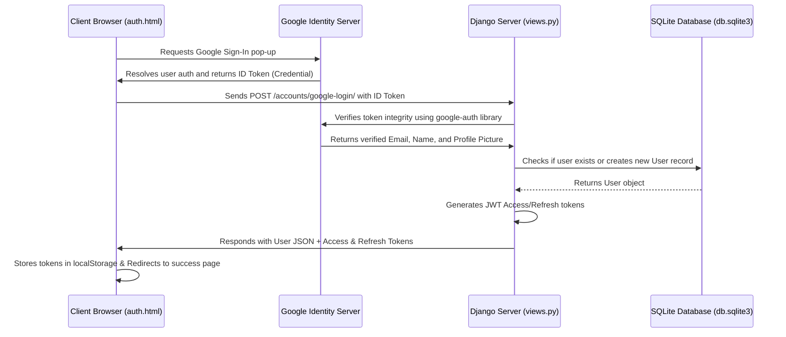

# NexusAuth — Google Sign-In & Django JWT Portal

A modern, high-performance web authentication application showcasing secure local registration, standard login, and single-click **Google OAuth 2.0 Sign-In** using a premium dark-themed interface. 

The application architecture utilizes **Django** and **Django REST Framework (DRF)** on the backend, **SimpleJWT** for token-based authentication, and a pure HTML/CSS/JavaScript client on the frontend with integrated **Google Identity Services (GSI) library**. The application stores its persistent state in a lightweight, self-contained **SQLite database** which requires zero configuration.

---

## 🚀 Key Features

* **Dual-Authentication Flow**:
  - **Standard Sign Up & Sign In**: Users can register and sign in with a username, email, and password. Credentials are encrypted on the backend with secure cryptographic hashing algorithms.
  - **One-Tap Google Authentication**: Streamlined sign-in flow that validates the user's Google Account ID Token on the backend using the official `google-auth` library, creating user accounts on-the-fly.
* **Auto-Profile Synchronization**: Dynamically retrieves and stores the user's Google profile picture upon authentication and updates it if the Google avatar changes.
* **JWT Token Security**: Issues secure, session-less JSON Web Tokens (Access and Refresh) to keep requests authorized without server-side session overhead.
* **Premium User Interface**: Dark-themed user experience incorporating visual enhancements such as an interactive particle canvas, glowing ambient backgrounds, smooth glassmorphism containers, and custom micro-animations.

---

## 📂 Codebase Structure & Key Files

The project files are mapped as follows:

```text
google_auth/
├── .env                              # Environment configuration (OAuth keys)
├── requirements.txt                  # Python dependencies
├── config/                           # Django project root
│   ├── manage.py                     # Django management CLI utility
│   ├── db.sqlite3                    # In-built SQLite database file
│   ├── config/                       # Main configuration folder
│   │   ├── settings.py               # Database settings, installed apps, CORS
│   │   └── urls.py                   # Root URL configuration
│   └── accounts/                     # Authentication Application folder
│       ├── models.py                 # Custom User model definition
│       ├── serializers.py            # DRF serializers (Google token / user data)
│       ├── views.py                  # API endpoints and template rendering
│       ├── urls.py                   # App routing endpoints
│       └── templates/accounts/
│           ├── auth.html             # Main login/signup split portal template
│           └── success.html          # Secure post-login landing screen
└── venv/                             # Virtual Environment directory
```

### Reference Links to Core Components:
* **Settings & Config**: [settings.py](file:///C:/Users/sunny/OneDrive/Desktop/google_auth/config/config/settings.py)
* **API Handlers & Views**: [views.py](file:///C:/Users/sunny/OneDrive/Desktop/google_auth/config/accounts/views.py)
* **Custom Models**: [models.py](file:///C:/Users/sunny/OneDrive/Desktop/google_auth/config/accounts/models.py)
* **Data Serialization**: [serializers.py](file:///C:/Users/sunny/OneDrive/Desktop/google_auth/config/accounts/serializers.py)
* **Routing Tables**: [accounts/urls.py](file:///C:/Users/sunny/OneDrive/Desktop/google_auth/config/accounts/urls.py) and [config/urls.py](file:///C:/Users/sunny/OneDrive/Desktop/google_auth/config/config/urls.py)
* **UI Templates**: [auth.html](file:///C:/Users/sunny/OneDrive/Desktop/google_auth/config/accounts/templates/accounts/auth.html) and [success.html](file:///C:/Users/sunny/OneDrive/Desktop/google_auth/config/accounts/templates/accounts/success.html)

---

## 🛠️ Installation & Setup Guide

Follow these steps to run the project locally on your machine.

### Prerequisites

Ensure you have **Python 3.10+** installed on your system.

### Step 1: Open the Project Directory
Navigate to the root directory where the codebase is located:
```bash
cd google_auth
```

### Step 2: Set Up the Virtual Environment
Activate the pre-existing virtual environment (`venv`) to isolate dependencies:
* **Windows (PowerShell)**:
  ```powershell
  .\venv\Scripts\Activate.ps1
  ```
* **Windows (Command Prompt)**:
  ```cmd
  .\venv\Scripts\activate.bat
  ```
* **macOS / Linux**:
  ```bash
  source venv/bin/activate
  ```

### Step 3: Install Dependencies
Install all required libraries using the [requirements.txt](file:///C:/Users/sunny/OneDrive/Desktop/google_auth/requirements.txt) manifest:
```bash
pip install -r requirements.txt
```

### Step 4: Configure the Database
The project utilizes the lightweight, in-built **SQLite** database engines (`django.db.backends.sqlite3`). No manual installation or configuration of a database server (like PostgreSQL or MySQL) is required.

Apply the database migrations to prepare the schema inside [db.sqlite3](file:///C:/Users/sunny/OneDrive/Desktop/google_auth/config/db.sqlite3):
```bash
python config/manage.py migrate
```

### Step 5: Configure the Google Client ID
To use Google Sign-In, you need to create a project on the Google Cloud Console.

1. Go to the [Google Cloud Console](https://console.cloud.google.com/).
2. Create a new project.
3. Configure the **OAuth Consent Screen** (User Type: External).
4. Go to **Credentials** -> Click **Create Credentials** -> Select **OAuth Client ID**.
5. Select **Web Application** as the application type.
6. Under **Authorized JavaScript origins**, add:
   * `http://localhost:8000`
   * `http://127.0.0.1:8000`
7. Under **Authorized redirect URIs**, add:
   * `http://localhost:8000`
   * `http://127.0.0.1:8000/accounts/success/`
8. Click **Create** and copy your **Client ID**.
9. Open the [.env](file:///C:/Users/sunny/OneDrive/Desktop/google_auth/.env) file at the root of the project and replace the client ID value:
   ```env
   GOOGLE_CLIENT_ID="YOUR_GOOGLE_CLIENT_ID_HERE.apps.googleusercontent.com"
   ```

### Step 6: Start the Development Server
Launch Django's default development web server:
```bash
python config/manage.py runserver
```

### Step 7: Open the Application
Open your web browser and navigate to the application views:
* **Sign In Portal**: [http://127.0.0.1:8000/accounts/login-page/](http://127.0.0.1:8000/accounts/login-page/)
* **Sign Up Portal**: [http://127.0.0.1:8000/accounts/signup-page/](http://127.0.0.1:8000/accounts/signup-page/)

---

## 🔒 Security Architecture Details

Here is how the authentication pipeline behaves under the hood:



1. **Google Standard Standard Sign-In Button**: The frontend renders the secure Google login iframe using the standard client SDK.
2. **ID Token Forwarding**: On successful user interaction, Google provides an JWT-formatted `id_token` (credential) containing the user’s signed metadata.
3. **Backend Authentication & Verification**: The token is forwarded to the API. The view calls `google.oauth2.id_token.verify_oauth2_token` which validates the cryptographic signature of the token against Google's certificates.
4. **JWT Generation**: Upon validation, the backend matches the email address with a local account in the SQLite database or creates a new profile. Django REST Framework SimpleJWT then issues short-lived access and refresh tokens.
